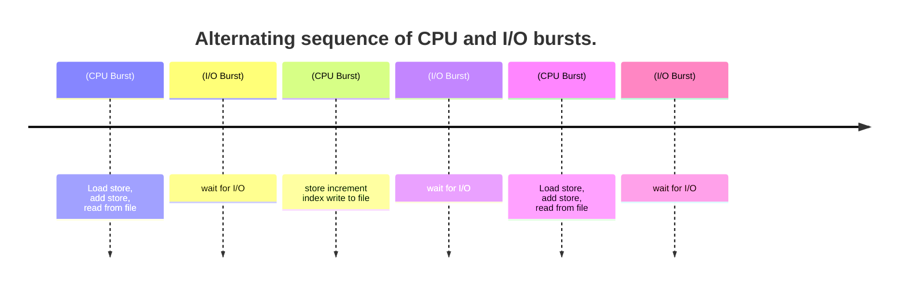

https://github.com/kangtegong/fastcampus-cs

<hr>

# ```ps -el``` 프로세스 우선순위

```
$ ps -el

PRI 프로세스 우선순위 : 낮을수록 높은 우선순위
NI

// ex)

F S   UID   PID  PPID  C PRI  NI ADDR SZ WCHAN  TTY          TIME CMD
0 S     0     1     0  0  80   0 -  2626 ?      ?        00:00:00 init(Ubuntu)
0 S     0     5     1  0  80   0 -  2628 ?      ?        00:00:00 init
0 S     0     9     1  0  80   0 -  2633 -      tty1     00:00:00 SessionLeader
0 S  1000    10     9  8  80   0 -  5675 -      tty1     00:00:01 zsh
0 S  1000    22     1  0  80   0 -  5228 -      tty1     00:00:00 zsh
0 S  1000    48     1  0  80   0 -  5599 -      tty1     00:00:00 zsh
0 S  1000    49     1  0  80   0 -  5595 -      tty1     00:00:00 zsh
0 S  1000    51    22  0  80   0 -  2874 ?      tty1     00:00:00 gitstatusd-linu
0 R  1000    61    10  3  80   0 -  4645 -      tty1     00:00:00 ps

```

https://tigris-data-science.tistory.com/entry/Linux-ps-%EB%AA%85%EB%A0%B9%EC%96%B4


- Understanding process thread priorities in Linux
  - https://blogs.oracle.com/linux/post/task-priority

- CPU Scheduling
  - https://www.cs.uic.edu/~jbell/CourseNotes/OperatingSystems/6_CPU_Scheduling.html


```
timeline
    title Alternating sequence of CPU and I/O bursts.
    (CPU Burst) : Load store,<br> add store,<br> read from file
    (I/O Burst) : wait for I/O
    (CPU Burst) : store increment index write to file
    (I/O Burst) : wait for I/O
    (CPU Burst) : Load store,<br> add store,<br> read from file
    (I/O Burst) : wait for I/O
```

- Scheduling Algorithms
  - https://www.cs.uic.edu/~jbell/CourseNotes/OperatingSystems/6_CPU_Scheduling.html

# top 명령어 활용(S = Process Status)

- R : Running:실행상태
- S : Sleeping: 대기 상태
- W : Waiting : 준비 상태
- S : Stopped : 종료 상태 
- Z : Zombie : 프로세스 종료 후 자원이 반환되었지만 커널 영역에 프로세스가 남아 있는 상태

https://www.geeksforgeeks.org/top-command-in-linux-with-examples/

# top command

```
f  설정화면 들어갈 수 있음 거기서 space로 체크함
```

```
top - 16:12:34 up 0 min,  0 users,  load average: 0.52, 0.58, 0.59
Tasks:   9 total,   1 running,   8 sleeping,   0 stopped,   0 zombie
%Cpu(s):  0.0 us,  1.4 sy,  0.0 ni, 98.6 id,  0.0 wa,  0.0 hi,  0.0 si,  0.0 st
MiB Mem :   4014.1 total,    424.1 free,   3366.0 used,    224.0 buff/cache
MiB Swap:  12288.0 total,  11239.9 free,   1048.1 used.    517.5 avail Mem

  PID USER      PR  NI    VIRT    RES    SHR S  %CPU  %MEM     TIME+ COMMAND
    1 root      20   0   10504    728    676 S   0.0   0.0   0:00.15 init(Ubuntu)
    5 root      20   0   10652    728    564 S   0.0   0.0   0:00.03 init
    9 root      20   0   10532    356    300 S   0.0   0.0   0:00.01 SessionLeader
   10 y         20   0   22700   6796   6732 S   0.0   0.2   0:01.19 zsh
   22 y         20   0   20912   1412   1360 S   0.0   0.0   0:00.04 zsh
   48 y         20   0   22396   1012    856 S   0.0   0.0   0:00.03 zsh
   49 y         20   0   22380    656    408 S   0.0   0.0   0:00.00 zsh
   51 y         20   0   11496    712    556 S   0.0   0.0   0:00.01 gitstatusd-linu
   61 y         20   0   18924   2076   1448 R   0.0   0.1   0:00.07 top
```

- space누르면 설정하면으로 들어가짐(Enter누르고 space눌러야 체크 or 해제됨)

```
Fields Management for window 1:Def, whose current sort field is %CPU
   Navigate with Up/Dn, Right selects for move then <Enter> or Left commits,
   'd' or <Space> toggles display, 's' sets sort.  Use 'q' or <Esc> to end!

* PID     = Process Id             nMaj    = Major Page Faults
* USER    = Effective User Name    nMin    = Minor Page Faults
* PR      = Priority               nDRT    = Dirty Pages Count
* NI      = Nice Value             WCHAN   = Sleeping in Function
* VIRT    = Virtual Image (KiB)    Flags   = Task Flags <sched.h>
* RES     = Resident Size (KiB)    CGROUPS = Control Groups
* SHR     = Shared Memory (KiB)    SUPGIDS = Supp Groups IDs
* S       = Process Status         SUPGRPS = Supp Groups Names
* %CPU    = CPU Usage              TGID    = Thread Group Id
* %MEM    = Memory Usage (RES)     OOMa    = OOMEM Adjustment
* TIME+   = CPU Time, hundredths   OOMs    = OOMEM Score current
* COMMAND = Command Name/Line      ENVIRON = Environment vars
  PPID    = Parent Process pid     vMj     = Major Faults delta
  UID     = Effective User Id      vMn     = Minor Faults delta
  RUID    = Real User Id           USED    = Res+Swap Size (KiB)
  RUSER   = Real User Name         nsIPC   = IPC namespace Inode
  SUID    = Saved User Id          nsMNT   = MNT namespace Inode
  SUSER   = Saved User Name        nsNET   = NET namespace Inode
  GID     = Group Id               nsPID   = PID namespace Inode
  GROUP   = Group Name             nsUSER  = USER namespace Inode
  PGRP    = Process Group Id       nsUTS   = UTS namespace Inode
  TTY     = Controlling Tty        LXC     = LXC container name
  TPGID   = Tty Process Grp Id     RSan    = RES Anonymous (KiB)
  SID     = Session Id             RSfd    = RES File-based (KiB)
  nTH     = Number of Threads      RSlk    = RES Locked (KiB)
  P       = Last Used Cpu (SMP)    RSsh    = RES Shared (KiB)
  TIME    = CPU Time               CGNAME  = Control Group name
  SWAP    = Swapped Size (KiB)     NU      = Last Used NUMA node
  CODE    = Code Size (KiB)
  DATA    = Data+Stack (KiB)
```

# ```pstree``` 프로세스의 계층적 구조

```
$ pstree
init(Ubuntu)─┬─SessionLeader───zsh───pstree
             ├─init───{init}
             ├─zsh───gitstatusd-linu───8*[{gitstatusd-linu}]
             ├─2*[zsh]
             └─{init(Ubuntu)}
```
